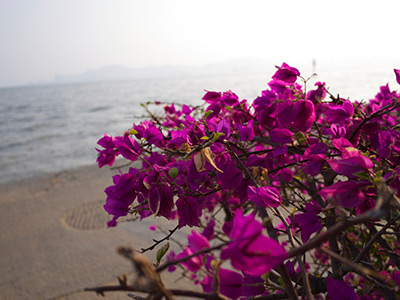
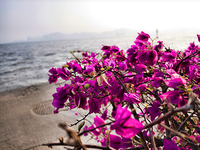
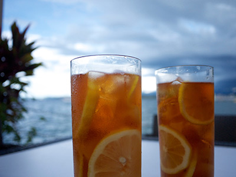
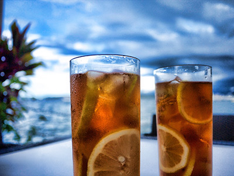

# Accelerated Contrast Limited Adaptive Histogram Equalization

This article describes the implementation detail of the CLAHE (Contrast Limited Adaptive Histogram Equalization) filter in [MetalPetal](https://github.com/MetalPetal/MetalPetal) and how it makes use of GPU acceleration to improve performance.

## Previews

| Before  | After |
| ------------- | ------------- |
|   |  |
|   |  |
|   |  |

## What is CLAHE

CLAHE (Contrast Limited Adaptive Histogram Equalization) is an algorithm for enhancing local contrast in images, and is frequently used in application areas like underwater photography, traffic control, astronomy, and medical imaging. 

CLAHE can also be used in the tone mapping operation of displaying a HDR (High Dynamic Range) image.

### HE, AHE, and CLAHE

Histogram equalization (HE) is a method in image processing of contrast adjustment using the image's histogram. This method usually increases the global contrast of many images, especially when the usable data of the image is represented by close contrast values. Through this adjustment, the intensities can be better distributed on the histogram. This allows for areas of lower local contrast to gain a higher contrast.

Adaptive histogram equalization (AHE) differs from ordinary histogram equalization in the respect that the adaptive method computes several histograms, each corresponding to a distinct section of the image, and uses them to redistribute the lightness values of the image. It is therefore suitable for improving the local contrast and enhancing the definitions of edges in each region of an image.

AHE has a tendency to overamplify noise in relatively homogeneous regions of an image. A variant of adaptive histogram equalization called contrast limited adaptive histogram equalization (CLAHE) prevents this by limiting the amplification.

## Recipes for CLAHE

### The Basic routine

1. Compute the neighborhood histogram for each pixel in the image.

2. Clip each histogram at a predefined value and redistribute the clipped histogram equally among all the histogram bins.

3. Compute the CDF (Cumulative Distribution Function) and transformation function for each pixel using the clipped histogram.

4. Apply the transformation function to each pixel to get the equalized image.

### Dealing with color image

Instead of applying CLAHE separately to the R, G, B channel of a color image, a better approach would be applying the algorithm only to the luminance channel of a color image, which also prevents the unwanted hue and saturation change, however requires the source image to be converted to a Lab color space first.

### Using interpolation to improve efficiency

The basic routine of CLAHE includes the computation of the neighborhood histogram for every single pixel. It is more efficient to partition the image into equally sized regions (called `tiles`), compute the histogram and transformation function for every region. The final value of a pixel can then be decided by interpolating the values of the pixel calculated by the transformation functions of nearby regions.

## Implementation of MTICLAHEFilter

`MTICLAHEFilter` is built on top of [Metal](https://developer.apple.com/metal/) and [MetalPetal](https://github.com/MetalPetal/MetalPetal). The implementation utilizes the full power of GPU and can achieve real-time performance.

Source code files: 

[MTICLAHEFilter.h](https://github.com/MetalPetal/MetalPetal/blob/master/Frameworks/MetalPetal/Filters/MTICLAHEFilter.h)

[MTICLAHEFilter.m](https://github.com/MetalPetal/MetalPetal/blob/master/Frameworks/MetalPetal/Filters/MTICLAHEFilter.m)

[CLAHE.metal](https://github.com/MetalPetal/MetalPetal/blob/master/Frameworks/MetalPetal/Shaders/CLAHE.metal)

[MTIShaderLib.h](https://github.com/MetalPetal/MetalPetal/blob/master/Frameworks/MetalPetal/Shaders/MTIShaderLib.h)

### Inputs and parameters

There are two input parameters: 

`clipLimit` controls the clip limit of the CLAHE, ranges from 0 to 256. The real integer clip limit is calculated as `clipLimit x tileSize.width x tileSize.height / 256`. With a default value of `2.0`.

`tileGridSize` controls the number of regions the input image will be divided into. With a default value of `8 x 8`.

### Extend the input image

As metioned before (using interpolation to improve efficiency), we need to partition the image into equally sized regions. The number of regions is determined by `tileGridSize` which is by default an 8 x 8 grid. If the image's width or height is not multiplies of `tileGridSize`'s width or height, it is not possible to partition the image. In this case we need to make the image a little larger to make it be able to partition with the `tileGridSize`.

```
// MTICLAHEFilter.m

dY = (tileGridSize.height - (inputImage.size.height % tileGridSize.height)) % tileGridSize.height;
dX = (tileGridSize.width - (inputImage.size.width % tileGridSize.width)) % tileGridSize.width;
```

`dX` and `dY` is how many pixels we need to extend the image in x and y direction respectively. The extended area is filled by mirroring the pixels over the image's border, this can be easily done using a sampler with `mirror_repeat` address mode.

The image extending can be done along with the RGB to lightness operation to reduce the number of render passes. (Using fragement shader `CLAHERGB2Lightness`)

[CLAHE.metal](https://github.com/MetalPetal/MetalPetal/blob/master/Frameworks/MetalPetal/Shaders/CLAHE.metal)

### RGB / HSL

In order to process the RGB color image. The image is first converted to HSL color space. CLAHE is then applied to the L (Lightness) channel of the image.

At the beginning of the workflow, the input image is converted to HSL, and at the very end of the workflow, it is converted back to RGB. So, the following steps, such as histogram calculation, interpolation are all take place within the HSL color space, specifically the lightness channel.

A single channel pixel format (`MTLPixelFormatR8Unorm`) is used here for the lightness channel image to reduce memory and power usage.

### Compute histograms and transformation functions

After the extended lightness image is generated, we compute the histogram and the transformation function for each tile in the lightness image. 

#### Compute histogram

We need integer values of pixel count for every lightness level. Fortunately `MetalPerformanceShaders.framework` provides us a high performance shader to calculate image histogram - `MPSImageHistogram`.

We need to encode `tileGridSize.width x tileGridSize.height` histogram calculation commands, one for each tile.

```
// MTICLAHEFilter.m

for (NSUInteger tileIndex = 0; tileIndex < numberOfTiles; tileIndex += 1) {
    NSInteger colum = tileIndex % tileGridSize.width;
    NSInteger row = tileIndex / tileGridSize.width;
    histogramKernel.clipRectSource = MTLRegionMake2D(colum * tileSize.width, row * tileSize.height, tileSize.width, tileSize.height);
    [histogramKernel encodeToCommandBuffer:renderingContext.commandBuffer
                             sourceTexture:inputLightnessImageResolution.texture
                                 histogram:histogramBuffer
                           histogramOffset:tileIndex * histogramSize];
}
```

The histograms are stored in `histogramBuffer`, which has the size of `numberOfTiles x histogramSize`. The `histogramSize` is determined by the `MPSImageHistogram` instance.

```
// MTICLAHEFilter.m

MPSImageHistogram *histogramKernel = ...;
size_t histogramSize = [histogramKernel histogramSizeForSourceFormat:inputLightnessImagePixelFormat];
```

#### Clip the histogram and create the lightness lookup textures

Next, we need to clip each histogram at a predefined value and redistribute the clipped histogram equally among all the histogram bins,  then create a lightness lookup table to do the equalization.

A lookup table is used to represent the transformation function. It is a 1D array which contains 256 slots, the value of each slot is the transformed value for the pixel with the lightness value of the slot's index.

```
transformation_function(x) -> transformation_lookup_table[x];
```

A compute pipeline is used to do the job. (Kernel function `CLAHEGenerateLUT`)

The inputs for the compute pipeline includes:

`clipLimitValue`  the integer clip limit from the input `clipLimit` using `MAX((NSInteger)(clipLimit * tileSize.width * tileSize.height / MTICLAHEHistogramBinCount), 1);`

`histogramBins` the number of the histogram bins, in our case `256`.

`totalPixelCountPerTile` the number of the pixels in one tile. i.e. `tileSize.width * tileSize.height`.

`numberOfLUTs` the number of output lightness lookup table. i.e. total tile count.

`histogramBuffer` the buffer contains all the histograms.

The output of the compute pipleline is a image which contains all the lightness lookup tables, aligned vertically. Here's an example:


We dispatch one thread for each histogram, since we need to process all the histograms, and these histograms can be processed simultaneously.

```
// MTICLAHEFilter.m

w = kernelState.LUTGeneratingPipeline.state.threadExecutionWidth;
threadsPerThreadgroup = MTLSizeMake(w, 1, 1);
threadgroupsPerGrid = MTLSizeMake((numberOfLUTs + w - 1) / w, 1, 1);
[commandEncoder dispatchThreadgroups:threadgroupsPerGrid threadsPerThreadgroup:threadsPerThreadgroup];
```

For each GPU compute thread, first, clip and redisturibute the histogram. 

`gid` here is the tile index.

1. Find the histogram from histogram buffer.

```
// CLAHE.metal

device uint *l = histogramBuffer + gid * parameters.histogramBins; 
const uint histSize = parameters.histogramBins;
```

2. Clip the histogram.

```
// CLAHE.metal

uint clipped = 0;
for (uint i = 0; i < histSize; ++i) {
    if(l[i] > parameters.clipLimit) {
        clipped += (l[i] - parameters.clipLimit);
        l[i] = parameters.clipLimit;
    }
}
```

3. Redistribute the clipped histogram equally among all the histogram bins.

```
// CLAHE.metal

const uint redistBatch = clipped / histSize;
uint residual = clipped - redistBatch * histSize;

for (uint i = 0; i < histSize; ++i) {
    l[i] += redistBatch;
}

if (residual != 0) {
    const uint residualStep = max(histSize / residual, (uint)1);
    for (uint i = 0; i < histSize && residual > 0; i += residualStep, residual--) {
        l[i]++;
    }
}
```

After the histogram is clipped and redistrbuted, we can create the transformation function (lightness lookup table) based on the clipped and redistrbuted histogram.

```
// CLAHE.metal

uint sum = 0;
const float lutScale = (histSize - 1) / float(parameters.totalPixelCountPerTile);
for (uint index = 0; index < histSize; ++index) {
    sum += l[index];
    outTexture.write(round(sum * lutScale)/255.0, uint2(index, gid));
}
```

### Apply the transformation function and do interpolation

We can easily get the target lightness for any input lightness in any tile using a texture sample operation.

`lutTexture` is the lightness lookup texture we got from last step, which contains lightness lookup tables for each tile.

`index` is the tile index we want to lookup. Tiles are distributed vertically.

`x` is the input lightness.

```
// CLAHE.metal
// Transformation function

outputLightness = lutTexture.sample(lutSamper, float2(x, (index + 0.5)/lutTexture.get_height())).r;
```

Because the image is partitioned into equally sized tiles, the lightness lookup tables are appropriate for the tile center pixels. All other pixels should be transformed with four lightness lookup tables of the tiles with center pixels closest to them, and are assigned interpolated values.

In this step, we also take care of the RGB/HSL conversion and output the final image.

Releated metal shader code for this step can be found at [CLAHE.metal](https://github.com/MetalPetal/MetalPetal/blob/master/Frameworks/MetalPetal/Shaders/CLAHE.metal)  `CLAHEColorLookup` function.

## Performance

By using `MetalPerformanceShaders`, custom compute and render pipelines, we are able to place all the calculations on the GPU. The performance is outstanding. We can process 1080p images at 60fps with the default parameters on an Apple A9 chip.

**Input Image Size: 1920x1080, Tiles: 8x8**

| Device  | MTICLAHEFilter GPU | OpenCV |
| ------------- | ------------- | ------------- |
| Apple A11 | ~9.6 ms / 60fps | ~11.5 ms |
| Apple A9 | ~14ms / 60fps | ~29ms |

**Input Image Size: 4032*3024, Tiles: 8x8**

| Device  | MTICLAHEFilter GPU | OpenCV |
| ------------- | ------------- | ------------- |
| Apple A11 | ~15.6ms / 60fps | ~68ms |
| Apple A9 | ~42ms / 25fps | ~176ms |


*MTICLAHEFilter GPU performance is measured using "Instruments - Metal System Trace".*

*OpenCV CLAHE performance is measured by running the following code 32 times and averaged.*

```
cv::cvtColor(cvImage, cvImage, cv::COLOR_RGB2YCrCb);
cv::Mat yChannel;
cv::extractChannel(cvImage, yChannel, 0);
cv::Ptr<cv::CLAHE> clahe = cv::createCLAHE();
clahe -> apply(yChannel, yChannel);
cv::insertChannel(yChannel, cvImage, 0);
cv::cvtColor(cvImage, cvImage, cv::COLOR_YCrCb2RGB);
```

---

© 2019 Yu Ao

<a rel="license" href="http://creativecommons.org/licenses/by/4.0/"></a><br />This work is licensed under a <a rel="license" href="http://creativecommons.org/licenses/by/4.0/">Creative Commons Attribution 4.0 International License</a>.
